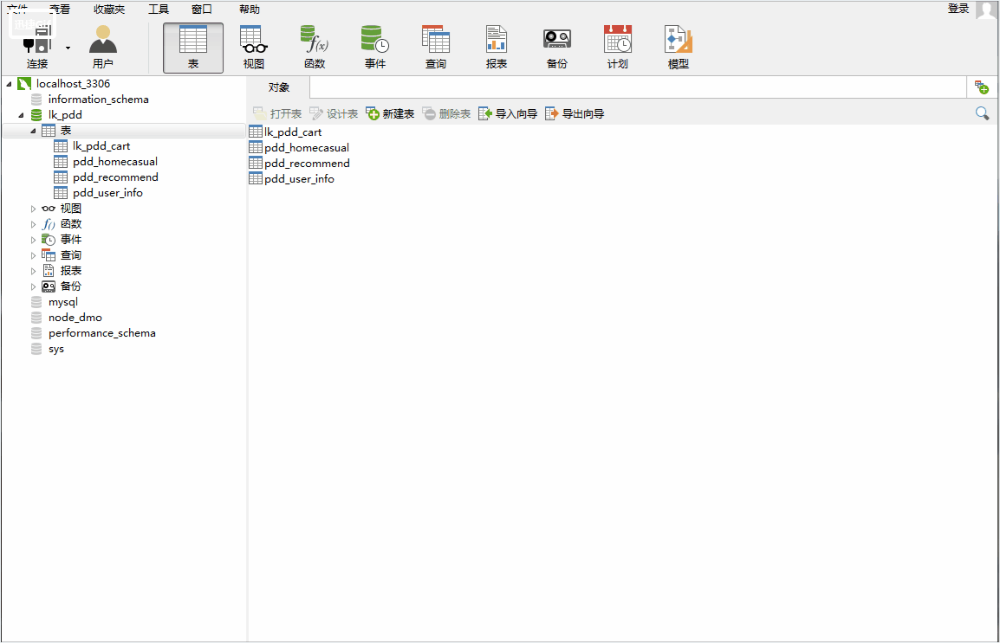
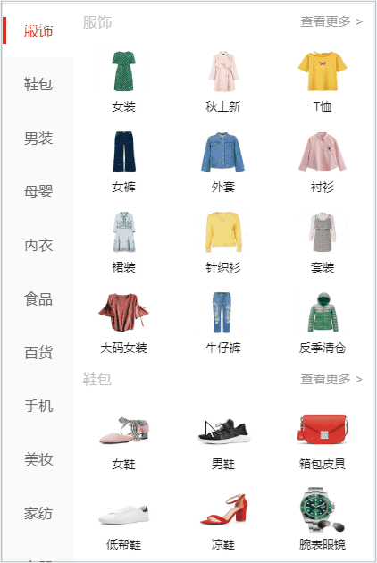

# vue2.0移动端项目实战

> vue2.0 + vuex + axios + mysql + node + express

### 说明：
   这是一个用vue2.0实现的一个移动端商城项目，实现首页，推荐，搜索，购物车，我的，登录功能，基本打通移动端商城项目，后端的数据来源node+mysql，
	 来搭建本地数据库。项目的案例，也是自己在网上课程学到的，

### 项目结构
```
  |——— build  #webpack编译相关文件目录，一般不需要动
	|——— config  #配置环境变量
	|    |——— dev.env.js #开发环境变量
	|		 |——— index.js   #主配置文件
	|    |——— prod.js    #生产环境变量
	|——— node_modules #一些常用安装的依赖
	|——— src #前端项目源码目录
	|    |——— api     #axios封装
	|    |——— assets  #资源目录
	|		 |——— common  #公用文件目录
	|    |——— components   #公共组件
	|    |——— pages   #组件以及页面文件目录
	|    |——— router  #路由目录
	|    |——— store   #数据状态管理
	|    |——— App.vue #项目入口文件
	|    |——— main.js #项目核心文件
	|——— static       #开发模式下静态资源目录
	|——— index.html   #首页入口文件，你可以添加一些 meta 信息或同统计代码啥的
	|——— package.json #项目配置文件
	|___ README.md    #项目的说明文档，markdown 格式
```

### 技术栈
	1. vuejs2.0：一套构建用户界面的渐进式框架，易用、灵活、高效。
	2. vue-router：官方的路由组件，配合vue.js创建单页应用（SPA）非常简单。
	3. axios: 基于 Promise 的 HTTP 请求客户端，可同时在浏览器和 node.js 中使用。
	4. swiper: 基于 Swiper3、适用于 Vue 的轮播组件，支持服务端渲染和单页应用。
	5. fastclick: 解决移动端点击延迟方案
	6. stylus: css样式解析，语法
	7. better-scroll: 移动滚动插件
	8. vuex: 数据状态管理库
	9. moment: 时间日期格式化
	10. mint-ui: 移动端ul框架
	11. ly-tab: 导航组件
	12. vue-lazyload: 图片懒加载

### 数据接口

1.接口图片展示

2.接口说明，
所有的接口文档已经放在static目录中，pdd_api存在接口，mysql文件存放数据，接口需要自己下载到本都重新初始化，mysql数据需要自己用数据库直接引入就可以使用、

### 常见引入第三方
import '@/common/css/style.css' 字体图标

### 项目编译和运行

	0. 项目的数据来源是mysql，下载数据不存在，需要自己搭建数据接口，
  1. 可以直接在git上下载项目源码。把github下载到本地，
		git clone  https://github.com/MrZHLF/vue-.git
	2. 进入到tourism目录，进行初始化，安装依赖
		npm  install
	3. 依赖安装成功后执行启动命令
	   npm run dev
	  如果显示一下内容说明安装成功
	   I  Your application is running here: http://localhost:8080

### 成果展示


